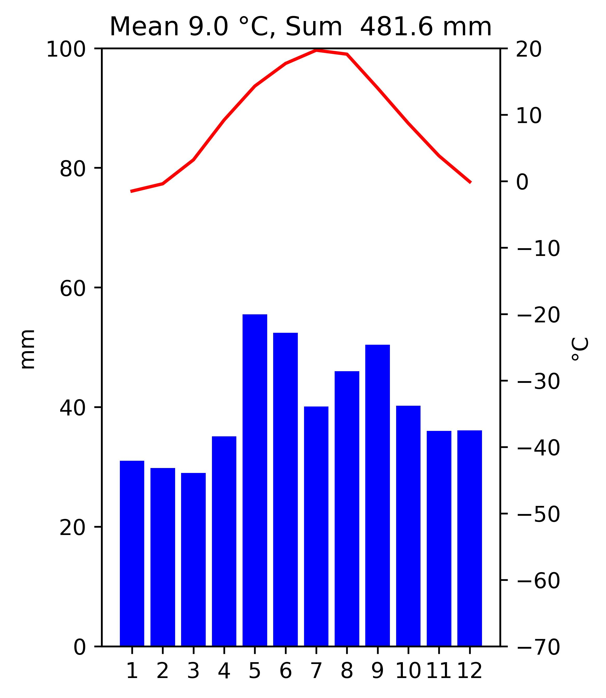
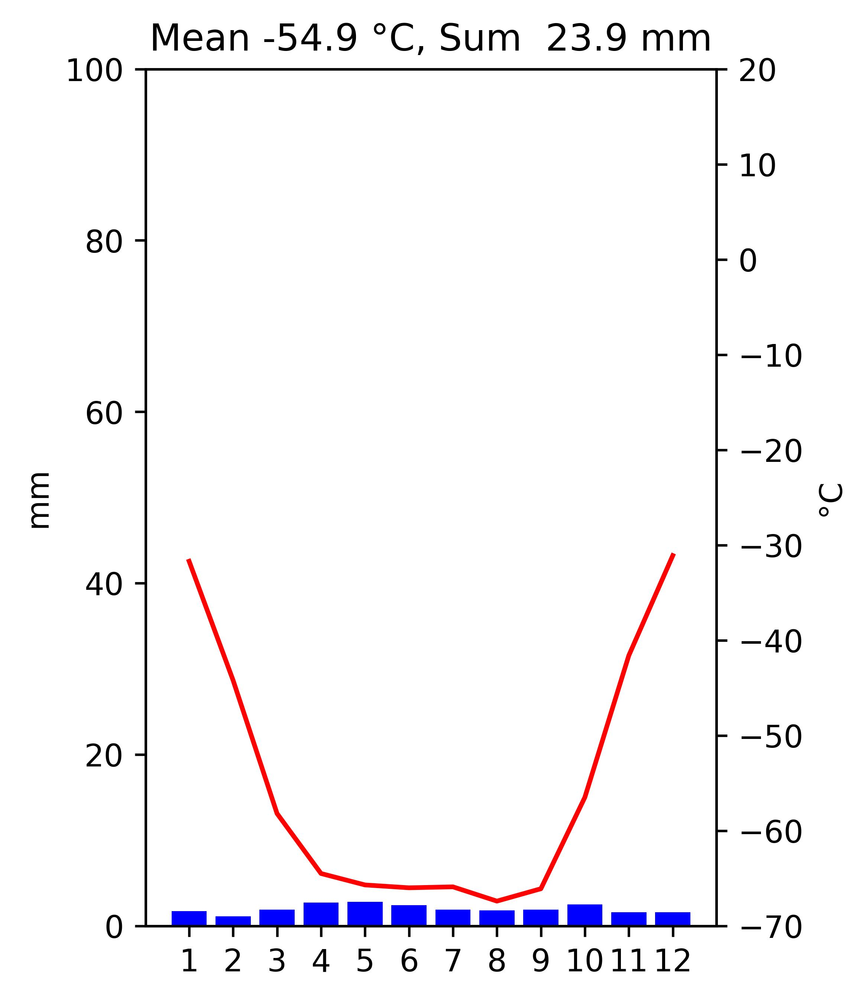

# python misc

Miscellaneous Python scripts.

# Table of contents

- [Installation](#installation)
- [Scripts](#scripts)
  - [climate_data_unit_converter](#climate_data_unit_converter)
  - [climate_diagram_generator](#climate_diagram_generator)
  - [morse_encoder](#morse_encoder)

# Installation <a name=installation>

1. Install pipenv virtual management tool: [pipenv](https://pipenv.pypa.io/en/latest/)
2. Change directory to main project directory.
3. Create virtual environment: `pipenv shell`
4. Install dependencies: `pipenv install`

# Scripts <a name=scripts>

## climate_data_unit_converter <a name=climate_data_unit_converter>

Script to convert climate data (temperature, precipitation) between Celsius degrees/millimeters
and Fahrenheit degrees/inches.

Usage:

```
python climate_data_unit_converter.py [-h, --help]  
                                      -i INPUT --input INPUT
                                      -o OUTPUT --output OUTPUT
                                      -t TARGET_UNIT --target-unit TARGET_UNIT 
```

**-h, --help**  
display help

**-i, --input**  
input data path

**-o, --output**  
output data path

**-t, --target-unit**  
unit of measure to which data will be converted, available values are: 
  * `C_mm` - result units: Celsius degrees, millimeters
  * `F_inch` - result units: Fahrenheit degrees, inches

Example input data (CSV file):

    Station;Element;Jan;Feb;Mar;Apr;May;Jun;Jul;Aug;Sep;Oct;Nov;Dec
    Warsaw;Temp;-1.5;-0.4;3.2;9.2;14.3;17.7;19.7;19.1;14.0;8.7;3.8;-0.1
    Warsaw;Precipitation;31.0;29.8;29.0;35.1;55.5;52.4;40.1;46.0;50.4;40.2;36.0;36.1
    Vostok;Temp;-31.7;-44.2;-58.2;-64.5;-65.7;-66.0;-65.9;-67.4;-66.1;-56.5;-41.6;-31.1
    Vostok;Precipitation;1.7;1.1;1.9;2.7;2.8;2.4;1.9;1.8;1.9;2.5;1.6;1.6

## climate_diagram_generator <a name=climate_diagram_generator>

Script to create climate diagrams based on monthly temperature, precipitation 
data stored in CSV file.

Usage:

    python climate_diagram_generator <path-to-data-file>

Example input data (CSV file):

    Station;Element;Jan;Feb;Mar;Apr;May;Jun;Jul;Aug;Sep;Oct;Nov;Dec
    Warsaw;Temp;-1.5;-0.4;3.2;9.2;14.3;17.7;19.7;19.1;14.0;8.7;3.8;-0.1
    Warsaw;Precipitation;31.0;29.8;29.0;35.1;55.5;52.4;40.1;46.0;50.4;40.2;36.0;36.1
    Vostok;Temp;-31.7;-44.2;-58.2;-64.5;-65.7;-66.0;-65.9;-67.4;-66.1;-56.5;-41.6;-31.1
    Vostok;Precipitation;1.7;1.1;1.9;2.7;2.8;2.4;1.9;1.8;1.9;2.5;1.6;1.6

Output - jpg files with climate diagrams

Warsaw


Vostok


## morse_encoder <a name=morse_encoder>

Script to convert text into Morse code. 

Notes: 
* allowed characters in message to be encoded: A-Z, space
* encoded message - space between words will be encoded into '/' character

Usage:
```
python morse_encoder.py [-h]
                        -m [MESSAGE] --message [MESSAGE]
                        [-o] [OUTPUT_FILE] [--output] [OUTPUT_FILE]
```
**-h, --help**  
display help

**-m, --message**  
message to be encoded

**-o, --output**  
path to the file with input/encoded message
