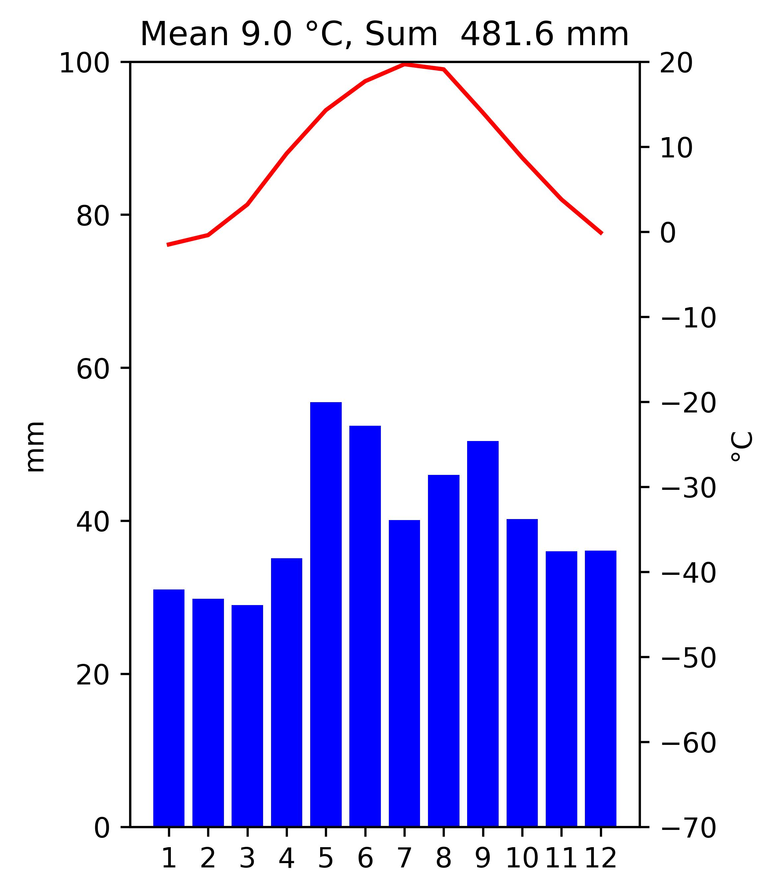

- [Scripts](#Scripts)  
  - [climate_data_unit_converter](#climate_data_unit_converter)  
  - [climate_diagram_generator](#climate_diagram_generator)  
- [eTOD_to_gpkg](#eTOD_to_gpkg)

# Scripts

Simple scripts without configuration file etc.

## climate_data_unit_converter

Script to convert climate data (temperature, precipitation) between Celsius degrees, miliiters
and Fahrenheit degrees and inches.

Usage:

```
python climate_data_unit_converter.py [-h]  
                                      -i INPUT --input INPUT
                                      -o OUTPUT --output OUTPUT
                                      -t TARGET_UNIT --target-unit TARGET_UNIT 
```

Example input data (CSV file):

    Station;Element;Jan;Feb;Mar;Apr;May;Jun;Jul;Aug;Sep;Oct;Nov;Dec
    Warsaw;Temp;-1.5;-0.4;3.2;9.2;14.3;17.7;19.7;19.1;14.0;8.7;3.8;-0.1
    Warsaw;Precipitation;31.0;29.8;29.0;35.1;55.5;52.4;40.1;46.0;50.4;40.2;36.0;36.1
    Vostok;Temp;-31.7;-44.2;-58.2;-64.5;-65.7;-66.0;-65.9;-67.4;-66.1;-56.5;-41.6;-31.1
    Vostok;Precipitation;1.7;1.1;1.9;2.7;2.8;2.4;1.9;1.8;1.9;2.5;1.6;1.6

Notes:
* there is no information about unit used in source data
* if TARGET_UNIT is F_INCH - assumption that source data is in Celsius degrees and millimeters
* if TARGET_UNIT is C_MM - assumption that source data is in Fahrenheit degrees and inches

## climate_diagram_generator

Script to create climate diagrams based on monthly temperature, precipitation 
data stored in CSV file.

Usage:

    python climate_diagram_generator <data.csv>

Example input data (CSV file):

    Station;Element;Jan;Feb;Mar;Apr;May;Jun;Jul;Aug;Sep;Oct;Nov;Dec
    Warsaw;Temp;-1.5;-0.4;3.2;9.2;14.3;17.7;19.7;19.1;14.0;8.7;3.8;-0.1
    Warsaw;Precipitation;31.0;29.8;29.0;35.1;55.5;52.4;40.1;46.0;50.4;40.2;36.0;36.1
    Vostok;Temp;-31.7;-44.2;-58.2;-64.5;-65.7;-66.0;-65.9;-67.4;-66.1;-56.5;-41.6;-31.1
    Vostok;Precipitation;1.7;1.1;1.9;2.7;2.8;2.4;1.9;1.8;1.9;2.5;1.6;1.6

Output - two jpg files:

Warsaw.jpg


Vostok Station.jpg


# eTOD_to_gpkg

Script to convert eTOD (Electronic Terrain and Obstacle Data) to GeoPackage.

Usage:

```
python eTOD_converter.py [-i] INPUT_CSV [--input] INPUT_CSV
                         [-o] OUTPUT_GPKG [--output] OUTPUT_GPKG
                         [-c] CONFIG [--config] CONFIG
```

Example configuration file: see eTOD_to_gpkg/config_example.yml